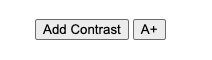

# accessibility-buttons

Web component buttons for adding/removing contrast and increasing/decreasing font size, enhancing the user experience for everyone.

<!-- [](https://coveralls.io/github/tiagoporto/accessibility-buttons) -->

## Install

```bash
npm install accessibility-buttons --save
```

## Usage

### Contrast Button

```js
// js
import 'accessibility-buttons/ContrastButton'
```

```html
<!-- html -->
<a11y-contrast-button
  add-contrast-label="Add Contrast"
  add-contrast-aria-label="Remove Contrast"
  remove-contrast-label="Add contrast"
  remove-contrast-aria-label="Remove contrast"
></a11y-contrast-button>
```

_All props are optional._

#### Styling contrast

Color, background and transition styles could be overridden by CSS variables. They are optional.

```css
:root {
  --a11y-color: #fff;
  --a11y-color-transition: color 0.95s ease-in;
  --a11y-background: #000;
  --a11y-background-transition: background 0.95s ease-in;
}
```

### Font Size Button

```js
import 'accessibility-buttons/FontSizeButton'
```

```html
<a11y-font-size-button
  increase-label="A+"
  increase-aria-label="Increase Font"
  decrease-label="A-"
  decrease-aria-label="Decrease Font"
></a11y-font-size-button>
```

#### Limitation

Font size works only with relative units, example `em` or `rem`.

#### Styling font size

Color, background and transition styles could be overridden by CSS variables. They are optional.

```css
:root {
  --a11y-font-size: 110%;
  --a11y-font-size-transition: font-size 0.7s linear;
}
```

### Styling



The button components are intentionally unstyled. This design choice, along with their rendering in the light DOM, allows for complete styling flexibility. You can apply custom styles directly using CSS, providing a seamless and familiar way to integrate them into your project`s design system.

Options:

```css
/* Global */
button {
  background: #000;
  color: #fff;
}

/* Contrast Button Component */
a11y-contrast-button button,
a11y-font-size-button button {
  background: #000;
  color: #000;
}

.a11y-contrast a11y-contrast-button button,
.a11y-contrast a11y-font-size-button button {
  border-color: #e3ff17;
  color: #e3ff17;
}
```

## Contributing

[Check how to contribute](https://github.com/tiagoporto/.github/blob/main/CONTRIBUTING.md).

## License

Accessibility Buttons © 2015 by Tiago Porto is licensed under [MIT License](LICENSE).
